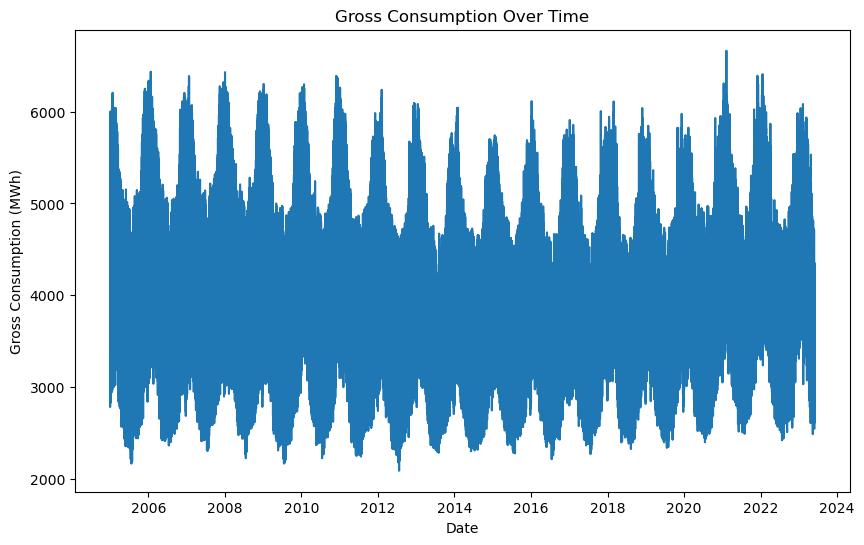
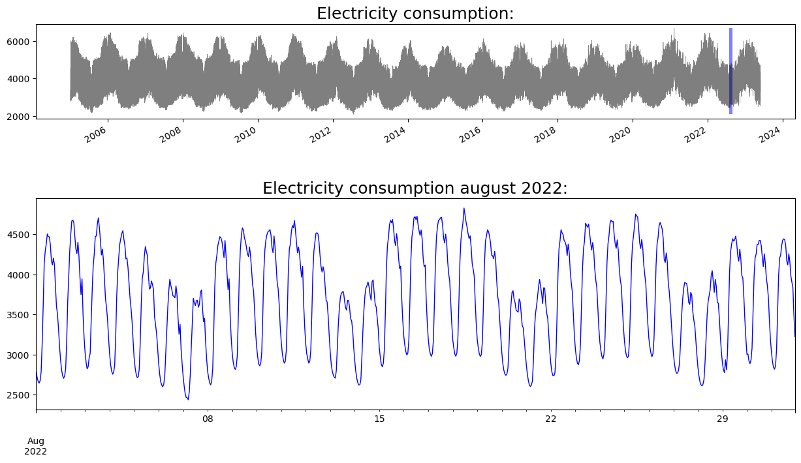
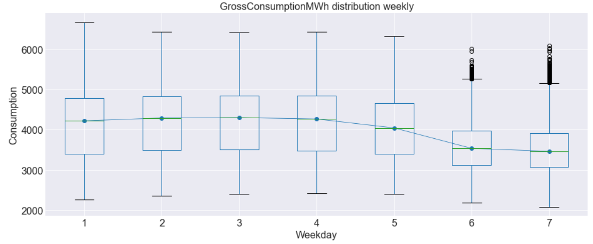

# Energy Data
The energy data for this project has been collected by using the API from [Energidataservice.dk](https://www.energidataservice.dk/). The exact dataset in question can be found [here](https://www.energidataservice.dk/tso-electricity/ProductionConsumptionSettlement) or downloaded from my github repository [here](https://github.com/madsh0402/Forecasting-energy-consumption-in-Denmark/tree/master/Data/Energy).


```python
import pandas as pd
# Indlæsning af data
Data = pd.read_csv("Production and Consumption - Settlement.csv")

# Konverter 'HourDK' til datetime format og sæt som index
Data['HourDK'] = pd.to_datetime(Data['HourDK'])
Data.set_index('HourDK', inplace=True)

Data.tail()
```


<div>
<table border="1" class="dataframe">
  <thead>
    <tr style="text-align: right;">
      <th></th>
      <th>HourUTC</th>
      <th>PriceArea</th>
      <th>CentralPowerMWh</th>
      <th>LocalPowerMWh</th>
      <th>CommercialPowerMWh</th>
      <th>LocalPowerSelfConMWh</th>
      <th>OffshoreWindLt100MW_MWh</th>
      <th>OffshoreWindGe100MW_MWh</th>
      <th>OnshoreWindLt50kW_MWh</th>
      <th>OnshoreWindGe50kW_MWh</th>
      <th>...</th>
      <th>ExchangeNO_MWh</th>
      <th>ExchangeSE_MWh</th>
      <th>ExchangeGE_MWh</th>
      <th>ExchangeNL_MWh</th>
      <th>ExchangeGreatBelt_MWh</th>
      <th>GrossConsumptionMWh</th>
      <th>GridLossTransmissionMWh</th>
      <th>GridLossInterconnectorsMWh</th>
      <th>GridLossDistributionMWh</th>
      <th>PowerToHeatMWh</th>
    </tr>
    <tr>
      <th>HourDK</th>
      <th></th>
      <th></th>
      <th></th>
      <th></th>
      <th></th>
      <th></th>
      <th></th>
      <th></th>
      <th></th>
      <th></th>
      <th></th>
      <th></th>
      <th></th>
      <th></th>
      <th></th>
      <th></th>
      <th></th>
      <th></th>
      <th></th>
      <th></th>
      <th></th>
    </tr>
  </thead>
  <tbody>
    <tr>
      <th>2023-04-10 02:00:00</th>
      <td>2023-04-10T00:00:00</td>
      <td>DK2</td>
      <td>542.716430</td>
      <td>56.011137</td>
      <td>195.179447</td>
      <td>4.254726</td>
      <td>4.103300</td>
      <td>125.771092</td>
      <td>0.091373</td>
      <td>122.521582</td>
      <td>...</td>
      <td>NaN</td>
      <td>1218.86</td>
      <td>-923.75</td>
      <td>NaN</td>
      <td>-199.1</td>
      <td>1148.563281</td>
      <td>28.741000</td>
      <td>13.879016</td>
      <td>55.044378</td>
      <td>7.319560</td>
    </tr>
    <tr>
      <th>2023-04-10 01:00:00</th>
      <td>2023-04-09T23:00:00</td>
      <td>DK1</td>
      <td>295.084760</td>
      <td>174.085155</td>
      <td>67.325744</td>
      <td>11.743112</td>
      <td>110.835594</td>
      <td>607.133481</td>
      <td>3.237114</td>
      <td>855.111878</td>
      <td>...</td>
      <td>828.20</td>
      <td>718.94</td>
      <td>-1641.44</td>
      <td>-464.64</td>
      <td>158.6</td>
      <td>1726.785529</td>
      <td>66.019140</td>
      <td>28.708100</td>
      <td>73.265991</td>
      <td>9.637616</td>
    </tr>
    <tr>
      <th>2023-04-10 01:00:00</th>
      <td>2023-04-09T23:00:00</td>
      <td>DK2</td>
      <td>523.548447</td>
      <td>56.455218</td>
      <td>192.695424</td>
      <td>4.105949</td>
      <td>5.253700</td>
      <td>126.193216</td>
      <td>0.078260</td>
      <td>121.382998</td>
      <td>...</td>
      <td>NaN</td>
      <td>1252.83</td>
      <td>-945.39</td>
      <td>NaN</td>
      <td>-160.8</td>
      <td>1179.818996</td>
      <td>29.380099</td>
      <td>13.627976</td>
      <td>55.872573</td>
      <td>6.537930</td>
    </tr>
    <tr>
      <th>2023-04-10 00:00:00</th>
      <td>2023-04-09T22:00:00</td>
      <td>DK1</td>
      <td>365.348642</td>
      <td>184.294252</td>
      <td>67.073400</td>
      <td>12.139897</td>
      <td>108.930271</td>
      <td>580.453773</td>
      <td>2.587651</td>
      <td>872.101825</td>
      <td>...</td>
      <td>1313.43</td>
      <td>682.06</td>
      <td>-2128.03</td>
      <td>-450.36</td>
      <td>150.0</td>
      <td>1762.614751</td>
      <td>77.556467</td>
      <td>26.627500</td>
      <td>74.698764</td>
      <td>9.421748</td>
    </tr>
    <tr>
      <th>2023-04-10 00:00:00</th>
      <td>2023-04-09T22:00:00</td>
      <td>DK2</td>
      <td>577.949918</td>
      <td>59.068309</td>
      <td>193.441627</td>
      <td>4.415682</td>
      <td>5.439600</td>
      <td>114.727084</td>
      <td>0.072489</td>
      <td>116.494591</td>
      <td>...</td>
      <td>NaN</td>
      <td>1221.67</td>
      <td>-945.16</td>
      <td>NaN</td>
      <td>-152.3</td>
      <td>1200.284632</td>
      <td>29.300249</td>
      <td>13.956008</td>
      <td>56.731284</td>
      <td>2.712530</td>
    </tr>
  </tbody>
</table>
<p>5 rows × 26 columns</p>
</div>

Here you can see the last 5 observations of the dataset, which contains 319726 observations. However, there are 2 observations for each time point because there is one observation for each electricity network (DK1 and DK2). These can now be summed to get the consumption for all of Denmark for every hour from 2005-03-25 23:00:00 to 2023-04-10 00:00:00, and cut off all other variables except `HourDK` and `GrossConsumptionMWh`.
<div>
<table border="1" class="dataframe">
  <thead>
    <tr style="text-align: right;">
      <th></th>
      <th>HourDK</th>
      <th>GrossConsumptionMWh</th>
    </tr>
  </thead>
  <tbody>
    <tr>
      <th>0</th>
      <td>2005-01-01 00:00:00</td>
      <td>3370.256592</td>
    </tr>
    <tr>
      <th>1</th>
      <td>2005-01-01 01:00:00</td>
      <td>3237.832763</td>
    </tr>
    <tr>
      <th>2</th>
      <td>2005-01-01 02:00:00</td>
      <td>3101.580811</td>
    </tr>
    <tr>
      <th>3</th>
      <td>2005-01-01 03:00:00</td>
      <td>2963.392211</td>
    </tr>
    <tr>
      <th>4</th>
      <td>2005-01-01 04:00:00</td>
      <td>2854.805420</td>
    </tr>
    <tr>
      <th>...</th>
      <td>...</td>
      <td>...</td>
    </tr>
    <tr>
      <th>159840</th>
      <td>2023-05-30 19:00:00</td>
      <td>3935.964505</td>
    </tr>
    <tr>
      <th>159841</th>
      <td>2023-05-30 20:00:00</td>
      <td>3764.163099</td>
    </tr>
    <tr>
      <th>159842</th>
      <td>2023-05-30 21:00:00</td>
      <td>3655.639568</td>
    </tr>
    <tr>
      <th>159843</th>
      <td>2023-05-30 22:00:00</td>
      <td>3663.715933</td>
    </tr>
    <tr>
      <th>159844</th>
      <td>2023-05-30 23:00:00</td>
      <td>3308.564927</td>
    </tr>
  </tbody>
</table>
<p>159845 rows × 2 columns</p>
</div>

We can now take a closer look at the energy data by plotting it:

## Plotting the timeseries



It may be difficult to see anything beyond the fact that there is an annual season in the data where consumption rises in the winter and falls in the summer. Let's take a closer look at a year, a month, a week, and a day:


Here we can closer see the annual seasonality.



Here we can see the weekly seasonality where we can see that the energy consumption falls in the weekends.


Zoomed into a week of the timeseries it is even more apparent how big the difference is between weekday and weekend.


Zoomed into a single day the daily seasonality becomes apparent.

lets take a closer look into this seasonality with some boxplots.

## seasonality





