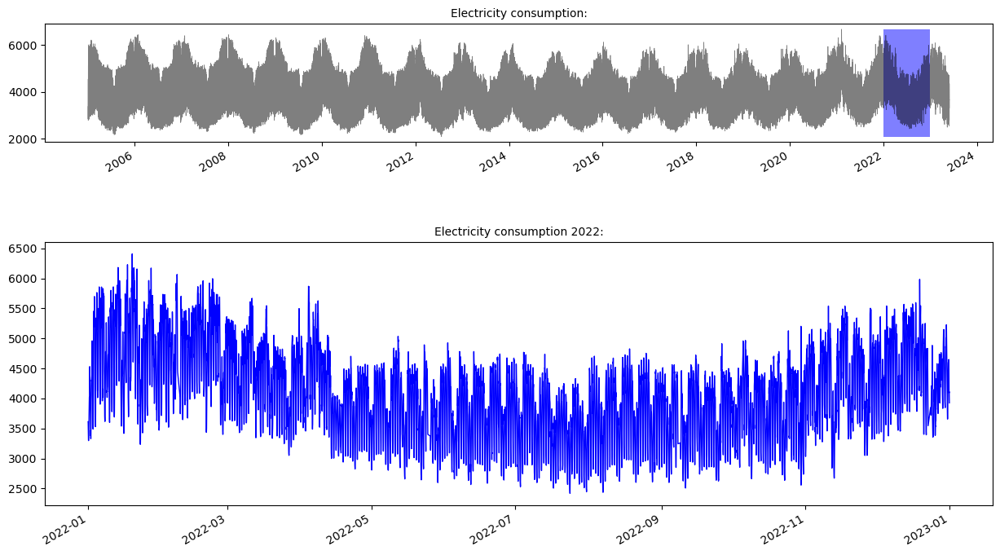
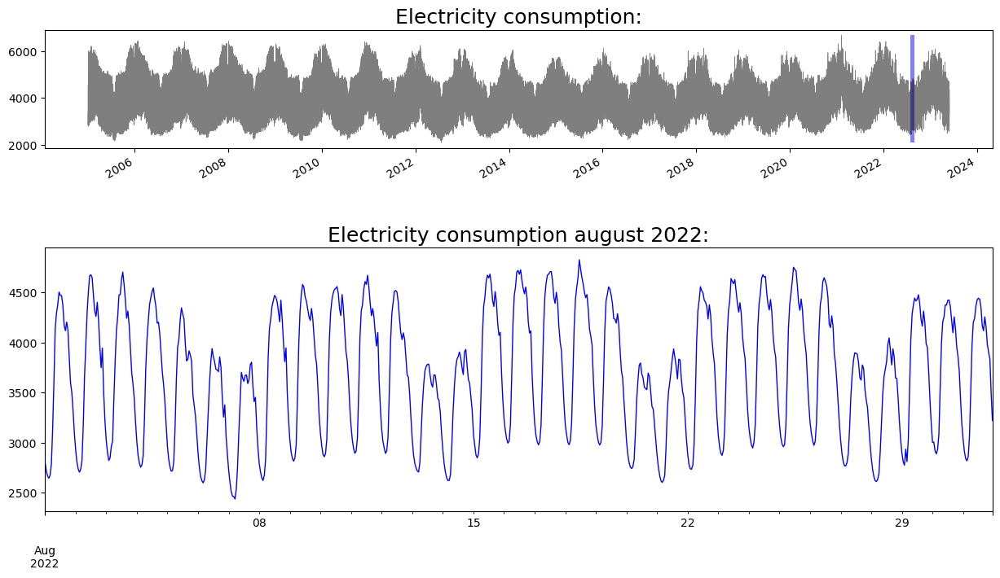
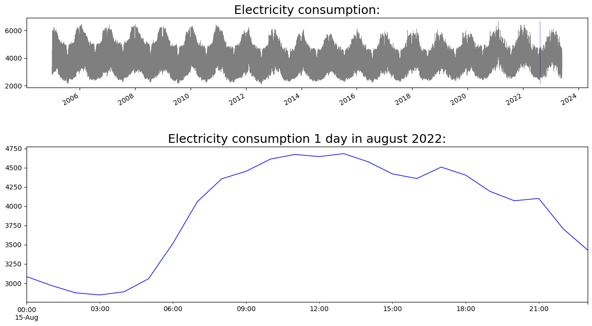

# Energi Data

The energy data for this project has been collected by using the API from [Energidataservice.dk](https://www.energidataservice.dk/). The exact dataset in question can be found [here](https://www.energidataservice.dk/tso-electricity/ProductionConsumptionSettlement) or downloaded from the github repository [here](https://github.com/madsh0402/Forecasting-energy-consumption-in-Denmark/tree/master/Data/Energy)


```python
import pandas as pd
# Indlæsning af data
Data = pd.read_csv("C:/Users/madsh/OneDrive/Dokumenter/kandidat/Fællesmappe/Speciale/Data/Data fra energidataservice.dk/Production and Consumption - Settlement.csv")

# Konverter 'HourDK' til datetime format og sæt som index
Data['HourDK'] = pd.to_datetime(Data['HourDK'])
Data.set_index('HourDK', inplace=True)

Data.tail()
```


<div>
<style scoped>
    .dataframe tbody tr th:only-of-type {
        vertical-align: middle;
    }

    .dataframe tbody tr th {
        vertical-align: top;
    }

    .dataframe thead th {
        text-align: right;
    }
</style>
<table border="1" class="dataframe">
  <thead>
    <tr style="text-align: right;">
      <th></th>
      <th>HourUTC</th>
      <th>PriceArea</th>
      <th>CentralPowerMWh</th>
      <th>LocalPowerMWh</th>
      <th>CommercialPowerMWh</th>
      <th>LocalPowerSelfConMWh</th>
      <th>OffshoreWindLt100MW_MWh</th>
      <th>OffshoreWindGe100MW_MWh</th>
      <th>OnshoreWindLt50kW_MWh</th>
      <th>OnshoreWindGe50kW_MWh</th>
      <th>...</th>
      <th>ExchangeNO_MWh</th>
      <th>ExchangeSE_MWh</th>
      <th>ExchangeGE_MWh</th>
      <th>ExchangeNL_MWh</th>
      <th>ExchangeGreatBelt_MWh</th>
      <th>GrossConsumptionMWh</th>
      <th>GridLossTransmissionMWh</th>
      <th>GridLossInterconnectorsMWh</th>
      <th>GridLossDistributionMWh</th>
      <th>PowerToHeatMWh</th>
    </tr>
    <tr>
      <th>HourDK</th>
      <th></th>
      <th></th>
      <th></th>
      <th></th>
      <th></th>
      <th></th>
      <th></th>
      <th></th>
      <th></th>
      <th></th>
      <th></th>
      <th></th>
      <th></th>
      <th></th>
      <th></th>
      <th></th>
      <th></th>
      <th></th>
      <th></th>
      <th></th>
      <th></th>
    </tr>
  </thead>
  <tbody>
    <tr>
      <th>2023-04-10 02:00:00</th>
      <td>2023-04-10T00:00:00</td>
      <td>DK2</td>
      <td>542.716430</td>
      <td>56.011137</td>
      <td>195.179447</td>
      <td>4.254726</td>
      <td>4.103300</td>
      <td>125.771092</td>
      <td>0.091373</td>
      <td>122.521582</td>
      <td>...</td>
      <td>NaN</td>
      <td>1218.86</td>
      <td>-923.75</td>
      <td>NaN</td>
      <td>-199.1</td>
      <td>1148.563281</td>
      <td>28.741000</td>
      <td>13.879016</td>
      <td>55.044378</td>
      <td>7.319560</td>
    </tr>
    <tr>
      <th>2023-04-10 01:00:00</th>
      <td>2023-04-09T23:00:00</td>
      <td>DK1</td>
      <td>295.084760</td>
      <td>174.085155</td>
      <td>67.325744</td>
      <td>11.743112</td>
      <td>110.835594</td>
      <td>607.133481</td>
      <td>3.237114</td>
      <td>855.111878</td>
      <td>...</td>
      <td>828.20</td>
      <td>718.94</td>
      <td>-1641.44</td>
      <td>-464.64</td>
      <td>158.6</td>
      <td>1726.785529</td>
      <td>66.019140</td>
      <td>28.708100</td>
      <td>73.265991</td>
      <td>9.637616</td>
    </tr>
    <tr>
      <th>2023-04-10 01:00:00</th>
      <td>2023-04-09T23:00:00</td>
      <td>DK2</td>
      <td>523.548447</td>
      <td>56.455218</td>
      <td>192.695424</td>
      <td>4.105949</td>
      <td>5.253700</td>
      <td>126.193216</td>
      <td>0.078260</td>
      <td>121.382998</td>
      <td>...</td>
      <td>NaN</td>
      <td>1252.83</td>
      <td>-945.39</td>
      <td>NaN</td>
      <td>-160.8</td>
      <td>1179.818996</td>
      <td>29.380099</td>
      <td>13.627976</td>
      <td>55.872573</td>
      <td>6.537930</td>
    </tr>
    <tr>
      <th>2023-04-10 00:00:00</th>
      <td>2023-04-09T22:00:00</td>
      <td>DK1</td>
      <td>365.348642</td>
      <td>184.294252</td>
      <td>67.073400</td>
      <td>12.139897</td>
      <td>108.930271</td>
      <td>580.453773</td>
      <td>2.587651</td>
      <td>872.101825</td>
      <td>...</td>
      <td>1313.43</td>
      <td>682.06</td>
      <td>-2128.03</td>
      <td>-450.36</td>
      <td>150.0</td>
      <td>1762.614751</td>
      <td>77.556467</td>
      <td>26.627500</td>
      <td>74.698764</td>
      <td>9.421748</td>
    </tr>
    <tr>
      <th>2023-04-10 00:00:00</th>
      <td>2023-04-09T22:00:00</td>
      <td>DK2</td>
      <td>577.949918</td>
      <td>59.068309</td>
      <td>193.441627</td>
      <td>4.415682</td>
      <td>5.439600</td>
      <td>114.727084</td>
      <td>0.072489</td>
      <td>116.494591</td>
      <td>...</td>
      <td>NaN</td>
      <td>1221.67</td>
      <td>-945.16</td>
      <td>NaN</td>
      <td>-152.3</td>
      <td>1200.284632</td>
      <td>29.300249</td>
      <td>13.956008</td>
      <td>56.731284</td>
      <td>2.712530</td>
    </tr>
  </tbody>
</table>
<p>5 rows × 26 columns</p>
</div>


Der kan her ses de sidste 5 observationer af det 319726 observationer store dataset, dog er der 2 observationer for hver tidspunkt, dette skyldes at der en observation for hvert elnetværk (DK1 og DK2) Disse kan nu summeres for at få forbrug og produktion for hele danmark for hvert time fra 2005-03-25 23:00:00 til 2023-04-10 00:00:00 og skære alle andre variable fra end `HourDK` og `GrossConsumptionMWh`.


```python
# Reset index
Data.reset_index(inplace=True)

# Select only the necessary columns
Energy_Data = Data[['HourDK', 'PriceArea', 'GrossConsumptionMWh']]

# Convert 'HourDK' to datetime format and set it as index
Energy_Data['HourDK'] = pd.to_datetime(Energy_Data['HourDK'])
Energy_Data.set_index('HourDK', inplace=True)

# Group by 'HourDK' and sum 'GrossConsumptionMWh' for each hour
Energy_Data = Energy_Data.groupby('HourDK')['GrossConsumptionMWh'].sum().reset_index()
Energy_Data
```

    C:\Users\madsh\AppData\Local\Temp\ipykernel_9972\4155592605.py:8: SettingWithCopyWarning: 
    A value is trying to be set on a copy of a slice from a DataFrame.
    Try using .loc[row_indexer,col_indexer] = value instead
    
    See the caveats in the documentation: https://pandas.pydata.org/pandas-docs/stable/user_guide/indexing.html#returning-a-view-versus-a-copy
      Energy_Data['HourDK'] = pd.to_datetime(Energy_Data['HourDK'])
    


<div>
<style scoped>
    .dataframe tbody tr th:only-of-type {
        vertical-align: middle;
    }

    .dataframe tbody tr th {
        vertical-align: top;
    }

    .dataframe thead th {
        text-align: right;
    }
</style>
<table border="1" class="dataframe">
  <thead>
    <tr style="text-align: right;">
      <th></th>
      <th>HourDK</th>
      <th>GrossConsumptionMWh</th>
    </tr>
  </thead>
  <tbody>
    <tr>
      <th>0</th>
      <td>2005-01-01 00:00:00</td>
      <td>3370.256592</td>
    </tr>
    <tr>
      <th>1</th>
      <td>2005-01-01 01:00:00</td>
      <td>3237.832763</td>
    </tr>
    <tr>
      <th>2</th>
      <td>2005-01-01 02:00:00</td>
      <td>3101.580811</td>
    </tr>
    <tr>
      <th>3</th>
      <td>2005-01-01 03:00:00</td>
      <td>2963.392211</td>
    </tr>
    <tr>
      <th>4</th>
      <td>2005-01-01 04:00:00</td>
      <td>2854.805420</td>
    </tr>
    <tr>
      <th>...</th>
      <td>...</td>
      <td>...</td>
    </tr>
    <tr>
      <th>159840</th>
      <td>2023-05-30 19:00:00</td>
      <td>3935.964505</td>
    </tr>
    <tr>
      <th>159841</th>
      <td>2023-05-30 20:00:00</td>
      <td>3764.163099</td>
    </tr>
    <tr>
      <th>159842</th>
      <td>2023-05-30 21:00:00</td>
      <td>3655.639568</td>
    </tr>
    <tr>
      <th>159843</th>
      <td>2023-05-30 22:00:00</td>
      <td>3663.715933</td>
    </tr>
    <tr>
      <th>159844</th>
      <td>2023-05-30 23:00:00</td>
      <td>3308.564927</td>
    </tr>
  </tbody>
</table>
<p>159845 rows × 2 columns</p>
</div>


vi kan nu tage et nærmere kig på energi dataen:


```python
import matplotlib.pyplot as plt

# Plotting
plt.figure(figsize=(10,6))
plt.plot(Energy_Data['HourDK'], Energy_Data['GrossConsumptionMWh'])
plt.title('Gross Consumption Over Time')
plt.xlabel('Date')
plt.ylabel('Gross Consumption (MWh)')
plt.show()
```


    

    


Det kan være svært at se noget ud over at der er en årlig sæson i dataen hvor forbruget stiger om vinteren og falder om sommeren. lad os tage et nærmere kig på et år, en måend, en uge og en dag.


```python
# Import necessary libraries
import matplotlib.pyplot as plt

# Year
year_data = Energy_Data[Energy_Data['HourDK'].dt.year == 2022]
plt.figure(figsize=(10,6))
plt.plot(year_data['HourDK'], year_data['GrossConsumptionMWh'])
plt.title('Gross Consumption Over Year 2022')
plt.xlabel('Date')
plt.ylabel('Gross Consumption (MWh)')
plt.show()

# Month
month_data = Energy_Data[(Energy_Data['HourDK'].dt.year == 2022) & (Energy_Data['HourDK'].dt.month == 6)]
plt.figure(figsize=(10,6))
plt.plot(month_data['HourDK'], month_data['GrossConsumptionMWh'])
plt.title('Gross Consumption Over June 2022')
plt.xlabel('Date')
plt.ylabel('Gross Consumption (MWh)')
plt.show()

# Week
week_data = Energy_Data[(Energy_Data['HourDK'].dt.year == 2022) & (Energy_Data['HourDK'].dt.week == 24)]
plt.figure(figsize=(10,6))
plt.plot(week_data['HourDK'], week_data['GrossConsumptionMWh'])
plt.title('Gross Consumption Over Week 24 of 2022')
plt.xlabel('Date')
plt.ylabel('Gross Consumption (MWh)')
plt.show()

# Day
day_data = Energy_Data[(Energy_Data['HourDK'].dt.year == 2022) & (Energy_Data['HourDK'].dt.month == 6) & (Energy_Data['HourDK'].dt.day == 15)]
plt.figure(figsize=(10,6))
plt.plot(day_data['HourDK'], day_data['GrossConsumptionMWh'])
plt.title('Gross Consumption Over June 15, 2022')
plt.xlabel('Date')
plt.ylabel('Gross Consumption (MWh)')
plt.show()
```


    

    


    

    


    C:\Users\madsh\AppData\Local\Temp\ipykernel_9972\150507758.py:23: FutureWarning: Series.dt.weekofyear and Series.dt.week have been deprecated. Please use Series.dt.isocalendar().week instead.
      week_data = Energy_Data[(Energy_Data['HourDK'].dt.year == 2022) & (Energy_Data['HourDK'].dt.week == 24)]
    


    

    


    

    


```python

```
